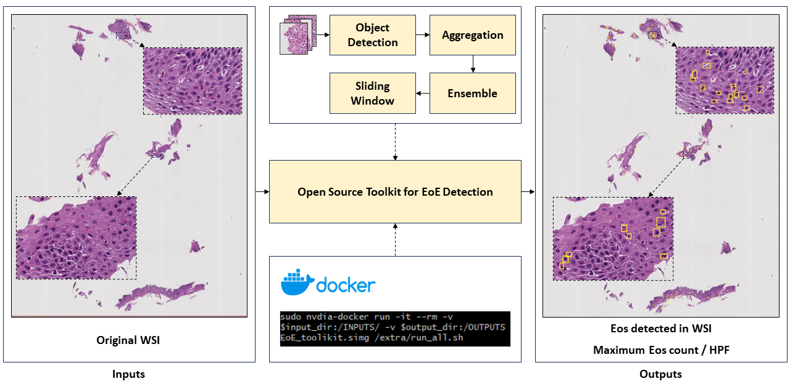

# Open-EoE
The official implementation of Open-EoE

## Abstract
Eosinophilic Esophagitis (EoE) is a chronic, immune/antigen-mediated esophageal disease, characterized by symptoms related to esophageal dysfunction and histological evidence of eosinophil-dominant inflammation. Owing to the intricate microscopic representation of EoE in imaging, current methodologies which depend on manual identification are not only labor-intensive but also prone to inaccuracies. In this study, we develop an open-source toolkit, named Open-EoE, to perform end-to-end whole slide image (WSI) level eosinophil (Eos) detection using one line of command via Docker. Specifically, the toolkit supports three state-of-the-art deep learning-based object detection models. Furthermore, Open-EoE further optimizes the performance by implementing an ensemble learning strategy, and enhancing the precision and reliability of our results. The experimental results demonstrated that the Open-EoE toolkit can efficiently detect Eos on a testing set with 289 WSIs. At the widely accepted threshold of ≥ 15 Eos per high power field (HPF) for diagnosing EoE, the Open-EoE achieved an accuracy of 91%, showing decent consistency with pathologist evaluations. This suggests a promising avenue for integrating machine learning methodologies into the diagnostic process for EoE.

## Installation
Please refer to [INSTALL.md](doc/INSTALL.md) for installation instructions of the detection phase.
